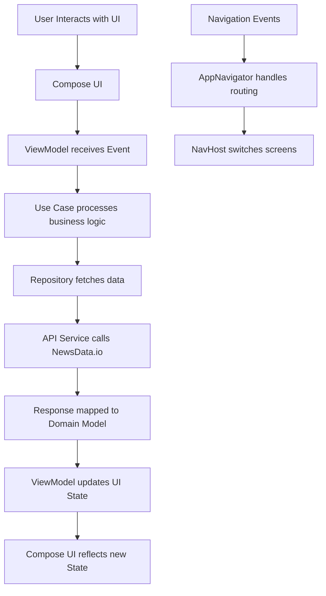

# MVI News App

A modern Android application built with MVI (Model-View-Intent) architecture, Clean Architecture, Jetpack Compose, Hilt, and Kotlin Coroutines. This app fetches and displays latest news using the NewsData.io API.

## Architecture

This project follows **Clean Architecture** principles with **MVI pattern**:

### Layers

1. **Presentation Layer** (UI)
   - `MainActivity` - Entry point
   - `HomeScreen` - News list UI
   - `DetailScreen` - News detail UI
   - ViewModels with MVI state management

2. **Domain Layer** (Business Logic)
   - Use Cases (e.g., `GetInitialHomeUseCase`)
   - Domain Models (e.g., `LatestNews`)
   - Business rules and validation

3. **Data Layer** (Data Access)
   - Repositories (e.g., `HomeRepository`)
   - API services (e.g., `HomeApi`)
   - Data models and mappers

### MVI Flow

```
User Action → Intent (Event) → ViewModel → Use Case → Repository → API
      ↓
UI State Update ← ViewModel ← Domain Logic ← Data Access ← Response
```

## Flow Diagram



## Setup

### Prerequisites

- Android Studio Arctic Fox or later
- JDK 11 or later
- Android SDK API 26+

### Clone Repository

```bash
git clone https://github.com/yourusername/MVI.git
cd MVI
```

### API Setup

1. Sign up for a free API key at [NewsData.io](https://newsdata.io/)
2. Create `keystore.properties` file in the project root:

```properties
BASE_URL="https://newsdata.io/api/"
API_KEY="your_api_key_here"
```

Replace `your_api_key_here` with your actual API key from NewsData.io.

### Build Configuration

The app uses version catalogs for dependency management. Key versions are defined in `gradle/libs.versions.toml`.

## How to Run

1. **Open in Android Studio**
   - Import the project
   - Sync Gradle files

2. **Build and Run**
   ```bash
   ./gradlew assembleDebug
   ./gradlew installDebug
   ```

3. **Run Tests**
   ```bash
   ./gradlew test
   ```

4. **Run on Device/Emulator**
   - Select target device
   - Click Run (green play button)

## Project Structure

```
MVI/
├── app/                          # Main application module
│   ├── src/main/
│   │   ├── AndroidManifest.xml
│   │   ├── java/com/example/mvi/
│   │   │   ├── MainActivity.kt   # App entry point
│   │   │   └── MainApplication.kt
│   │   └── res/                  # Resources
│   └── build.gradle.kts
├── core/                         # Shared core module
│   ├── src/main/java/com/example/core/
│   │   ├── di/                   # Dependency injection
│   │   ├── presentation/         # Base ViewModel
│   │   └── utils/                # Utilities
│   └── build.gradle.kts
├── home/                         # Home feature module
│   ├── src/main/java/com/example/home/
│   │   ├── data/                 # Data layer
│   │   ├── domain/               # Domain layer
│   │   └── presentation/         # Presentation layer
│   ├── src/test/                 # Unit tests
│   └── build.gradle.kts
├── detail/                       # Detail feature module
├── navigation/                   # Navigation module
├── network/                      # Network module
├── app-config-plugin/            # Custom plugin for config
├── gradle/libs.versions.toml     # Version catalog
├── keystore.properties           # API configuration
└── README.md
```

## Key Technologies

- **Kotlin** - Primary language
- **Jetpack Compose** - UI framework
- **Hilt** - Dependency injection
- **Retrofit** - HTTP client
- **Kotlin Coroutines & Flow** - Asynchronous programming
- **Navigation Compose** - Screen navigation
- **MockK** - Unit testing
- **JUnit** - Testing framework

## Testing

Run unit tests:

```bash
./gradlew testDebugUnitTest
```

Key test files:
- `GetInitialHomeUseCaseTest.kt` - Use case testing
- `HomeRepositoryTest.kt` - Repository testing
- `HomeViewModelTest.kt` - ViewModel testing

## API Documentation

This app uses [NewsData.io API](https://newsdata.io/docs) for fetching news articles.

- **Base URL**: https://newsdata.io/api/
- **Endpoint**: /1/latest
- **Parameters**: apikey (query parameter)

Example request:
```
GET https://newsdata.io/api/1/latest?apikey=YOUR_API_KEY
```

## Contributing

1. Fork the repository
2. Create a feature branch
3. Make changes
4. Add tests
5. Submit a pull request

## License

This project is licensed under the MIT License - see the LICENSE file for details.
